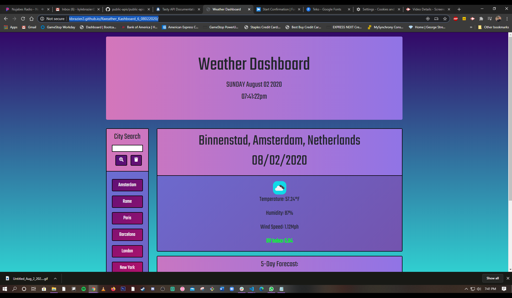

# 06 Server-Side APIs: Weather Dashboard

https://kbrazier2.github.io/Kweather_Kashboard_6_08022020/

Kweather Kashboard

We were tasked with creating a weather dashboard that allowed the user to search for a city, and be presented with that city's weather information.

- Jumbotron consists of live date and time
- Main contains current location featuring weather information for said location
- 5-Day Forecast below shows said location's weather information for the next 5 days
- Panel contains search bar for city searches
- Clicking a city pulls up said city's weather information / 5 day forecast on main part of page

Below are screenshots / animations showing the app's functionality:

.png)

